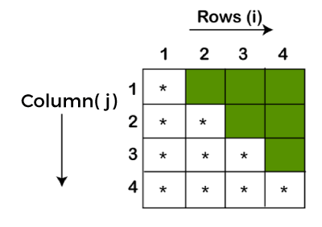

  

## Pattern Printing with solutions 
Patterns can be printed in python using simple for loops. First outer loop is used to handle number of rows and Inner nested loop is used to handle the number of columns.Manipulating the print statements, different number patterns, alphabet patterns or star patterns can be printed.

## 🛠 Skills
Python, loops etc

## Contributing
Contributions are always welcome!
